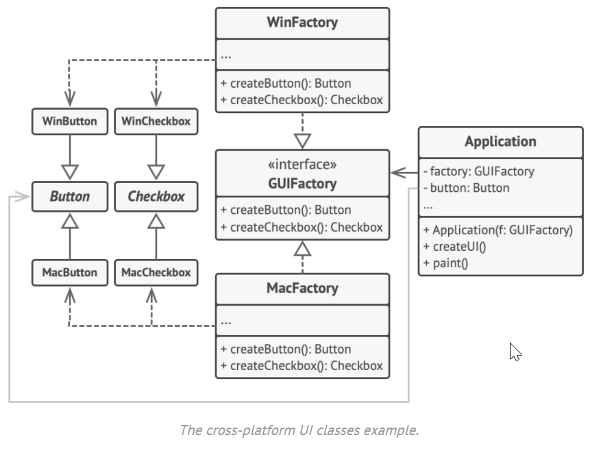

# Abstract Factory
## explication d'exemple

Dans les frameworks *GUI*, il y a des button pur windows, autre pour mac ... etc. pour simplifie le choix du button ou du widget d'une façon général, abtract factory vient pour résoudre ce problème. Alors le framework crée des concreteFactory *WinFactory* ou *MacFactory* implementant l'inteface *GUIFactory* qui represente AbstractFactory interface.